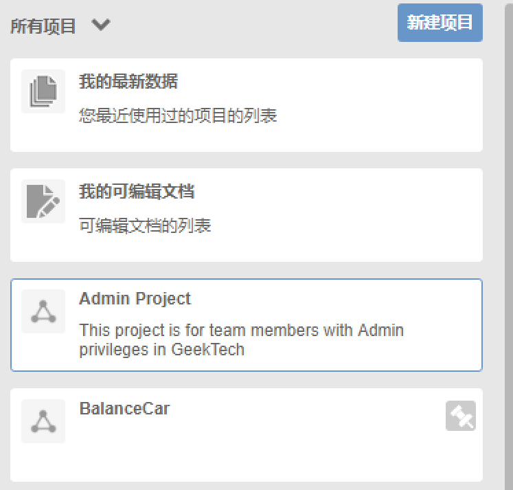
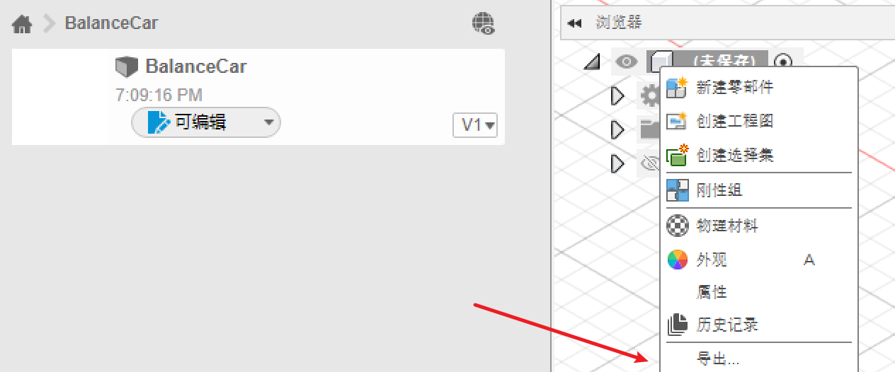
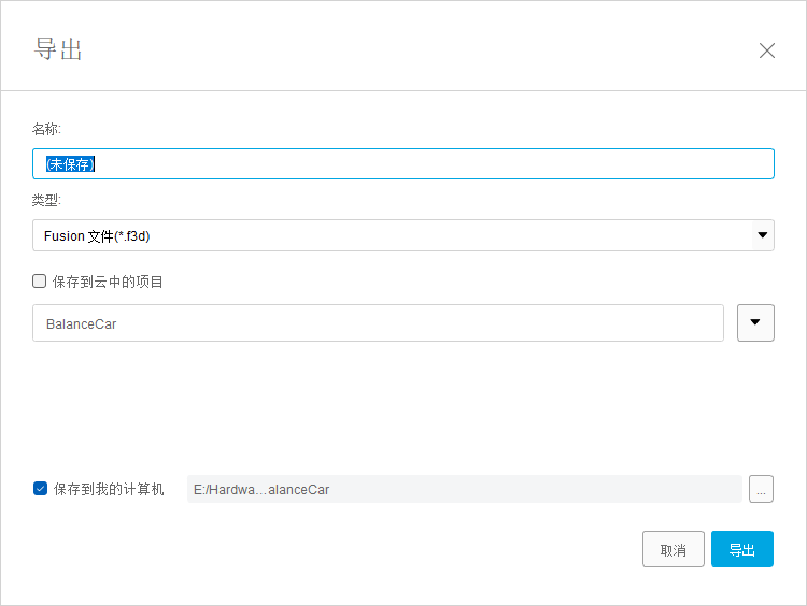

**Fusion360 使用教程**

## **一、场景基本的控制**

**1.1 场景的旋转：**Shift + 鼠标左键

## 二、工具的基本使用

**2.1 曲面工具：**

通过二维的轮廓，然后360°旋转所生成的实体。需要指定1）旋转轴  2）轮廓 两个信息实现曲面的生成。

## **三、模型的导出**

fusion360采用的是项目管理的方式，在下图中我们可以看到有Admin Project和BalanceCar两个项目，这些项目默认是云端同步的。

在项目中选择模型，右键选择导出可以导出Fusion360的文件格式。

在导出对话框中可以将模型导出到本地文件夹

