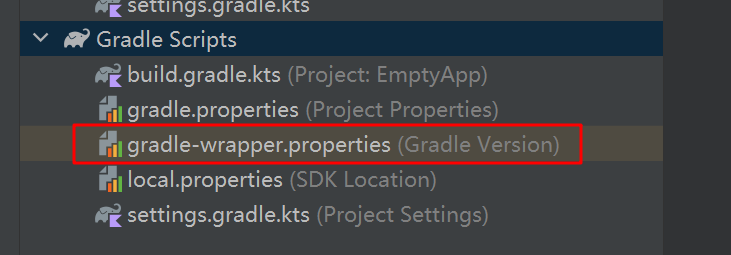

# 安卓开发环境配置问题

## 一、gradle的问题

​		由于国内网络环境的问题，导致gradle经常没有办法正常下载，从而难以正常构建Android程序。

## 1.1 gradle下载失败的问题

​		Android Studio首次创建项目或其他操作时，会更新Gradle，由于一些原因会导致下载失败，就会提示ERROR：Gradle project sync failed。解决办法如下：
​		1.根据报错提示的链接直接下载gradle-xxxxx.zip，可以通过浏览器在 https://services.gradle.org/distributions/ 下载对应的版本。


​			如上图所示，可以看到Android Studio正在下载gradle-8.0-bin.zip, 如果反复失败，可以通过上面的网址直接通过浏览器下载(如果不能访问可能需要使用科学上网)，在网页中，我们可以找到对应的下载链接。：


​		2.虽然AndroidStudio Gradle下载失败，但是会在你的C盘创建一个文件夹，如 C:\Users(你的用户名).gradle\wrapper\dists\gradle-6.5-bin\xxxxxxx(最后一级目录，每个人的文件名可能不一样)

​					

​		我们将步骤1中下载号的gradle-8.0-bin.zip复制到存在gradle-8.0-bin.zip.lck和gradle-8.0-bin.zip.part文件的文件夹中。

​		3.修改Android Studio的gradle-wrapper文件

<center>
    
</center>

​		修改的方式如下，不同环境下路径存在不同，根据实际情况调整即可，重要的是要正确映射gradle的位置。

```shell
# Fri Nov 24 11:56:39 CST 2023
distributionBase=GRADLE_USER_HOME
distributionPath=wrapper/dists
# 这是修改后的distributionUrl,把原先的网络地址映射为本地地址，程序通过本地地址下载
distributionUrl=file:///C:/Users/admin/.gradle/wrapper/dists/gradle-8.0-bin/ca5e32bp14vu59qr306oxotwh/gradle-8.0-bin.zip
# 下面是原地址
#distributionUrl=https\://services.gradle.org/distributions/gradle-8.0-bin.zip
zipStoreBase=GRADLE_USER_HOME
zipStorePath=wrapper/dists
```

​		4.最后，重启AndroidStudio或者点击Sync Now就可以了。

## 二、Maven仓库配置问题

​		目前最新版本的Android Studio的依赖配置和旧版本不太一样。一般来说，如果采用默认的仓库配置，下载速度过慢同时容易失败。

```shell
# 旧版
pluginManagement {
    repositories {
        //新增这 4 个
        maven { url 'https://maven.aliyun.com/repository/public/' }
        maven { url 'https://maven.aliyun.com/repository/google/' }
        maven { url 'https://maven.aliyun.com/repository/jcenter/' }
        maven { url 'https://maven.aliyun.com/repository/central/' }
        google()
        mavenCentral()
        gradlePluginPortal()
    }
}
dependencyResolutionManagement {
    repositoriesMode.set(RepositoriesMode.FAIL_ON_PROJECT_REPOS)
    repositories {
//新增这 4 个
        maven { url 'https://maven.aliyun.com/repository/public/' }
        maven { url 'https://maven.aliyun.com/repository/google/' }
        maven { url 'https://maven.aliyun.com/repository/jcenter/' }
        maven { url 'https://maven.aliyun.com/repository/central/' }
        google()
        mavenCentral()
    }
}
 
rootProject.name = "helloworld"
include ':app'
# 最新版 maven写法发生了改变 maven { url 'https://jitpack.io' } => maven { url = uri("https://jitpack.io") }
pluginManagement {
    repositories {
        maven { url = uri("https://maven.aliyun.com/repository/public/") }
        maven { url = uri("https://maven.aliyun.com/repository/google/") }
        maven { url = uri("https://maven.aliyun.com/repository/jcenter/") }
        maven { url = uri("https://maven.aliyun.com/repository/central/") }
        google()
        mavenCentral()
        gradlePluginPortal()
    }
}
dependencyResolutionManagement {
    repositoriesMode.set(RepositoriesMode.FAIL_ON_PROJECT_REPOS)
    repositories {
        maven { url = uri("https://maven.aliyun.com/repository/public/") }
        maven { url = uri("https://maven.aliyun.com/repository/google/") }
        maven { url = uri("https://maven.aliyun.com/repository/jcenter/") }
        maven { url = uri("https://maven.aliyun.com/repository/central/") }
        google()
        mavenCentral()
    }
}
```

