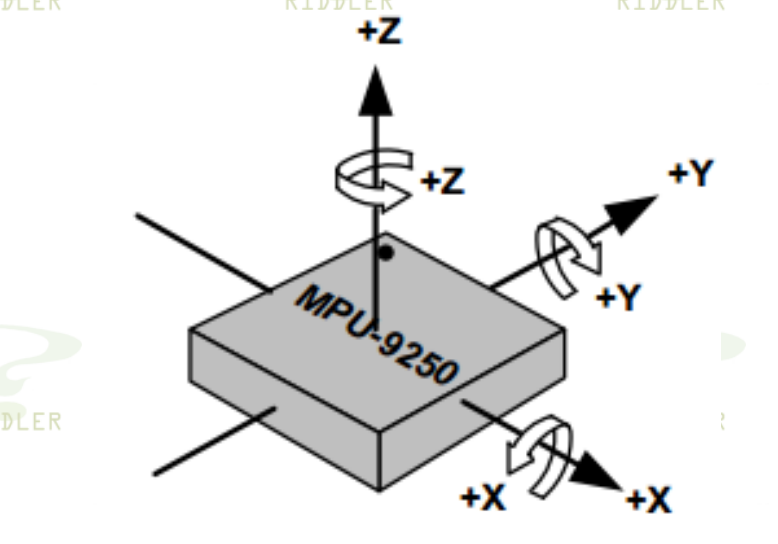
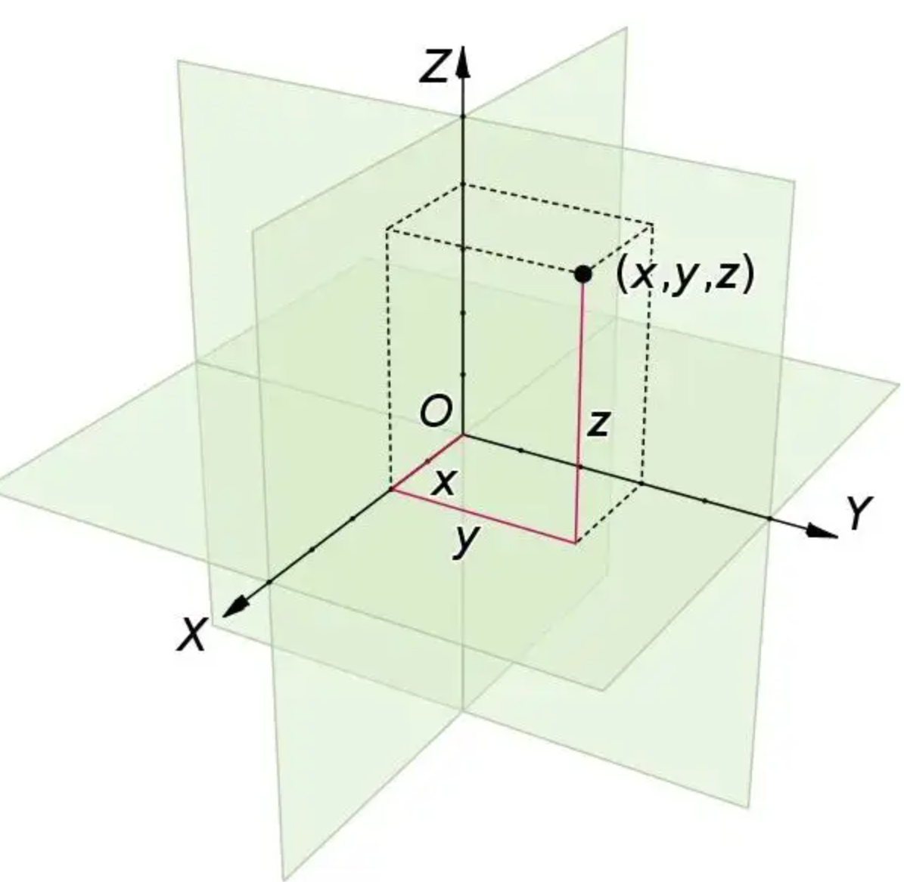

# **Mahony姿态解算**

**2022-09-27 ：詹力**

## 一、从IMU到Mahony的坐标系

​		实际上，Mahony是没有明确的坐标系的概念的，不管是什么传感器的坐标轴输入到Mahony，解算出来的四元数的qx,qy,qz就和原始输入Mahony的IMU的轴是对应的。但是，这样做的会造成四元数到欧拉角的计算出现混乱麻烦。为了代码方便，我们最好是先 **将IMU的坐标系映射到笛卡尔3D坐标系** 。以MPU9250为例子，其坐标轴定义如下图所示(加速度计和陀螺仪，MPU9250内置磁力计坐标系不同)。

<div align=center></div>

​		笛卡尔3D坐标系如下图所示：



​		将Mahony算法确定以笛卡尔3D坐标系方式描述，那么对应的转换代码如下所示：

```C++
Mahony.x = -Imu.y;
Mahony.y =  Imu.x;
Mahony.z =  Imu.z;
```

## 二、从四元数到欧拉角的转换

​		四元数到欧拉角的转换是和坐标系的定义存在关系的，在不同的坐标系下需要推导四元数到欧拉角的转换公式。这样非常的麻烦，除非在必要的情况下，一般用标准的笛卡尔3D坐标计算会比较方便。

​		笛卡尔3D坐标系下的四元数转换到欧拉角代码，如下所示：

```c++
Mahony.Pitch = asin(-2.0f*(z*x-w*y))* (180.0f /PI);
Mahony.Yaw   = atan2(y*x + w*z,0.5f - y*y - z*z)* (180.0f /PI);
Mahony.Roll  = atan2(y*z + w*x,0.5f - y*y - x*x)* (180.0f /PI);
```

## 三、Mahony算法中载体系的重力投影到地理系

​		常见代码的写法如下图所示：

```C
// 写法1
float halfvx = q1 * q3 - q0 * q2;
float halfvy = q0 * q1 + q2 * q3;
float halfvz = q0 * q0 - 0.5f + q3 * q3;
// 写法2
float vx = 2.0f*(q1*q3 - q0*q2);														 
float vy = 2.0f*(q0*q1 + q2*q3);															 
float vz = q0*q0 - q1*q1 - q2*q2 + q3*q3;
```

​		比较有差异的主要在于vz的写法，这两种的写法其实是一样的，推导如下所示

$$

\begin{align*}
  vz &= q_0^2-0.5+q_3^2 \\
  2vz &= 2q_0^2-1+2q_3^2 \\
    &= 2q_0^2+2q_3^2-q_0^2-q_1^2-q_2^2-q_3^2 \\
    &= q_0^2-q_1^2-q_2^2+q_3^2 \\
\end{align*}
$$
​		
