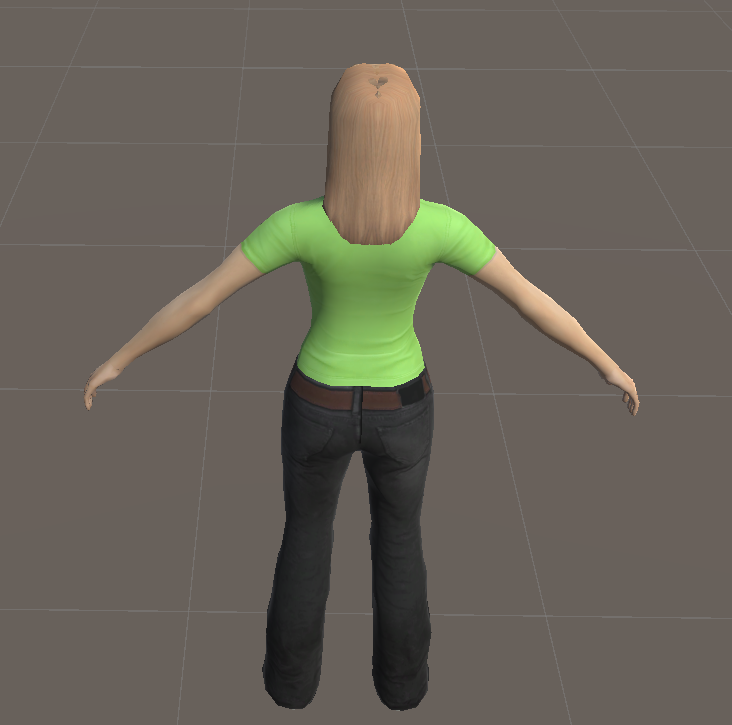
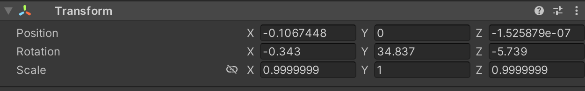
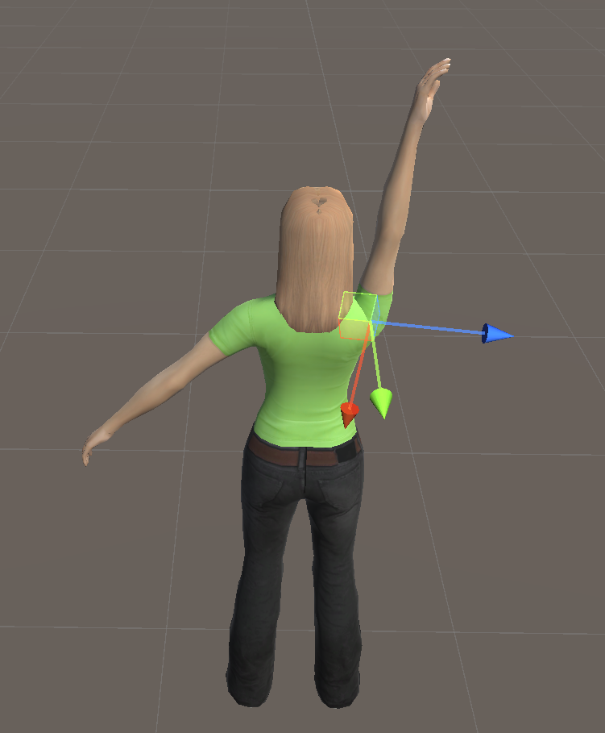

## Unity的基本操作

**一、场景的基本操作**

- 缩放：鼠标滚轮
- 旋转：鼠标箭头左键点击后拖动
- 拖动场景位置移动：鼠标滚轮按下

### **二、人物模型的控制**

**2.1 人物的结构和手动控制**

​		如下图所示，一般来说3D人物模型的身体部分都是躯体的骨骼模型，按照多叉树的结构组织的。对于每一部分的躯体部分都可以控制其平移、缩放、旋转等操作。

​		完整的人物呈现如下图所示（默认状态）：

​		对象的旋转、平移、缩放操作，可以通过窗口进行控制：

​		

​		设置手臂的Y轴旋转角度为-90°，可以看到：

**2.2 人物脚本控制**

​		