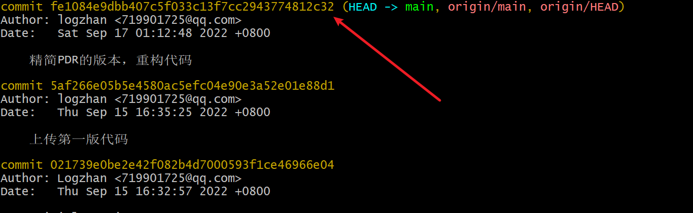

## 一、Commit回退(从一次Commit回退到某一次Commit)

1.1.查看历史提交记录

```shell
# git 查看历史commit
git log
```

1.2.复制上一次提交的commit码



1.3、输入回退命令

```shell
 git revert your_commit_code
```

## 二、放弃所有文件修改 （未Commit）

**2.1 解决方法**（两种解决方法）

```shell
# 方法1
git add .
git reset --hard "commit_code"

# 方法2，实际测试
git stash
git stash drop #丢弃指定条目
```

**2.1 git stash 命令**

别急，Git提供了一个**git stash命令**恰好可以完美解决该问题, 其将当前未提交的修改(即，工作区的修改和暂存区的修改)先暂时储藏起来，这样工作区干净了后，就可以切换切换到master分支下拉一个fix分支。在完成线上bug的修复工作后，重新切换到dev分支下通过**git stash pop**命令将之前储藏的修改取出来，继续进行新功能的开发工作