# Lighthouse定位原理

​		2016年，Valve携手HTC一同发布了跨时代般的VR头显:HTC VIVE,随之而来的是一套全新的空间定位技术：命名为Lighthouse的定位系统，具备高精度、高响应、轻便易用等特点，至今仍是VR全身追踪玩家首选的追踪设备。本文章详细解析Lighthouse初代系统（1.0基站系统）与不完全解析第二代系统（2017年6月发布的2.0基站系统）基站原理与追踪器定位原理，为方便理解将以1.0基站指代初代系统，2.0基站指代第二代系统。

## 一、Lighthouse定位原理：

### 1.1 Lighthouse定位架构

​		每个1.0基站包含一个称为同步闪光灯的红外灯阵列和俩组马达（集成激光发射器）。系统内20ms为一个扫描周期。基站的定位原理如下图所示：

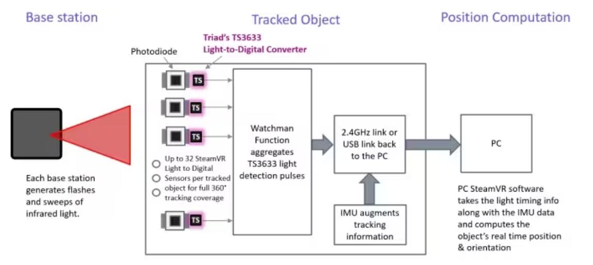

​		一个周期的定位过程：1、首先基站的红外灯阵列闪烁一次，发射一组红外光同步光覆盖整个扫描范围，当追踪器*1 上一组光敏（每个追踪器含有多组光敏）传感器组件搭载的光电转换芯片接收到该端光敏传感器捕捉到的来自基站的红外同步光信息后，启动全部传感器与惯性系统（IMU）并将数据清零。2、基站的X轴马达横向发射激光（旋转10ms闪烁一次后停止）3、基站的红外灯阵列再闪烁一次，追踪器捕捉到第二次红外光同步信息后将准备捕捉Y轴光数据 4、Y轴马达纵向发射激光（旋转10ms闪烁一次后停止），至基站下次红外灯阵列闪烁后代表一个扫描周期结束。如下图所示：

### 1.2 Lighthouse基站运行模式

​		1.0基站共有三种运行模式（通过按钮切换）：单独A模式，有线A、B模式，无线B、C模式。一个空间内只运行一个基站时，设置为A模式或B模式均可单独运行。一个空间内运行双基站，当俩个基站设置为A模式与B模式（有线模式）时，由A模式的基站作为主基站。将线缆连接俩个基站后，B模式的基站将与A模式基站通过线缆同步扫描周期（同步红外光阵列点亮时间与马达转速、激光发射器点亮间）当基站处于B、C模式（无线模式）时，由B模式的基站作为主基站，C模式的基站上的一组光敏捕捉到B模式基站的红外同步光后，通过分析一段时间内捕捉到的红外同步光的频率便可与B基站同步扫描周期（同步红外光阵列点亮时间与马达转速、激光发射器点亮时间）当一个空间内运行双基站时，由追踪器判定使用哪一个基站的激光：当多组光敏同时捕捉到某一个基站的光信息最多时，优先使用该组基站的激光参与融合计算。

## 二、 Lighthouse基站拆解

### 2.1 基站的面板拆解

​		1.0基站有俩种型号，分别为9灯与15灯基站(最早生产15灯基站，2017年后生产的基站基本为9灯基站)，9灯基站（红外光同步阵列含9颗灯珠）、15灯基站(红外光同步阵列含15颗灯珠)。9灯基站与15灯基站（区别为红外同步阵列灯珠数量）定位效果与原理相同，9灯阵列灯珠亮度更高。

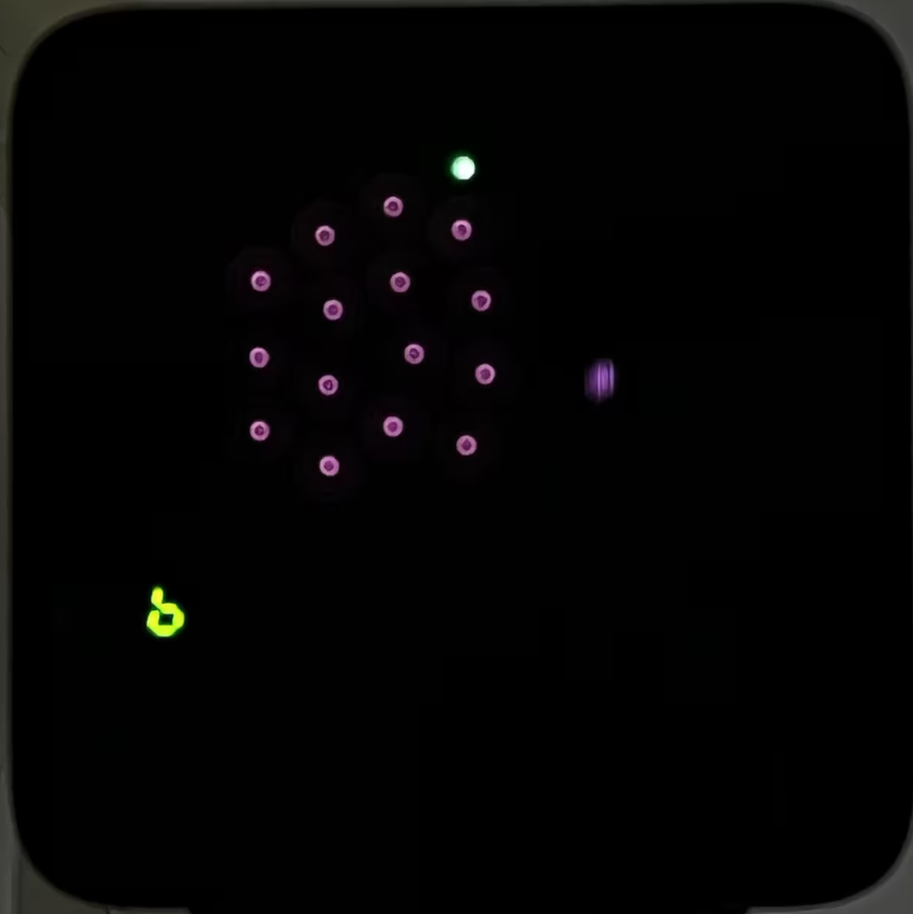

15灯基站运行图片

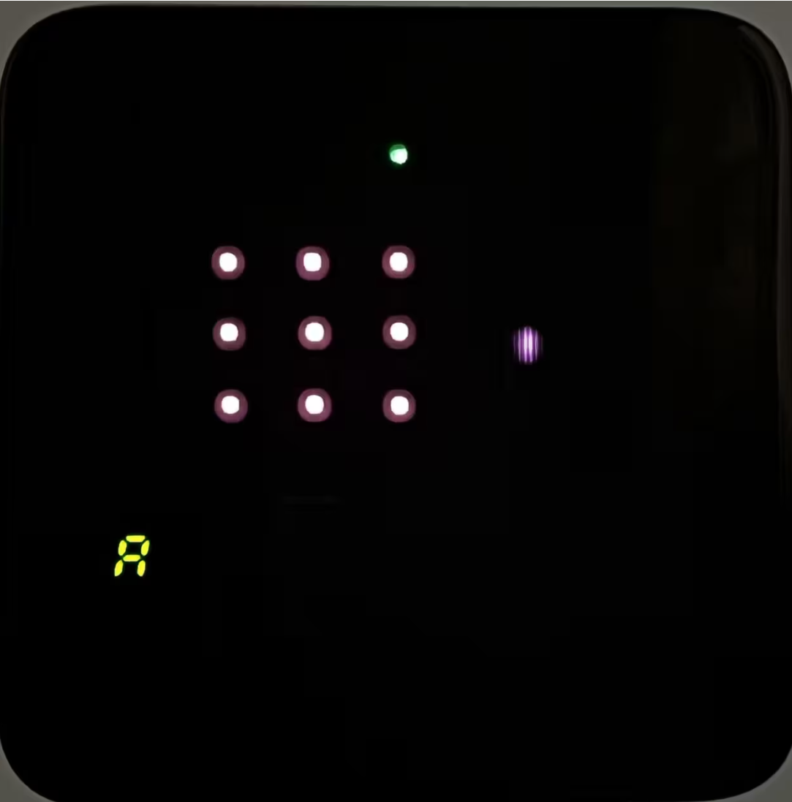

9灯基站运行图片
																				

​		Tracker1.0等1.0追踪器（搭载TS3633芯片）设备将与基站完成红外光同步，识别捕捉到的红外光信息为基站发出时才会进行定位。而后代更换TS4231或TSTS4631芯片的追踪器(如Tracker2018、Tracker3.0、Vive Pro头显与Vive2.0手柄等）上取消了红外光同步模式，当这类追踪器运行在1.0基站模式下，捕捉到红外光信息后将直接启动全部传感器，但无法判断是否为基站发射的同步光。当环境存在其他发射红外光的设备时，追踪器可能将其会误判为基站发射的同步光而错误定位，也就会产生所谓“干扰”丢追现象。

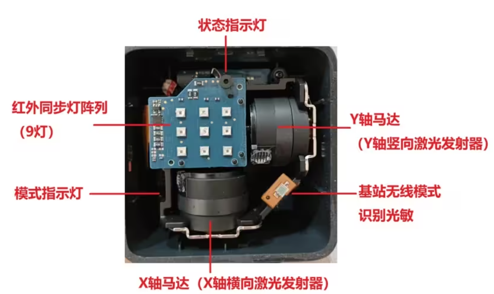

### 2.2 Tracker 1.0跟踪器原理和拆解

​		每个追踪器表面都覆盖有多组光敏传感器与光电转换器。当一组光敏传感器俩次捕捉到红外同步光后，分俩次捕捉到俩组激光。随后由该组光敏组件上搭载的光电转换器（如TS3633等）开始分别计算这俩组（X轴与Y轴）激光分别到达该组光敏的角度与时间，这个时间正好是基站X轴与Y轴马达旋转到特定的面、点亮激光发射器的时间与角度（基站位置为绝对静止，马达转速与激光发射器点亮时间为已知：一组马达一个周期旋转10ms并闪烁一次），而分布在追踪器上的光敏传感器的位置也是已知的，便可依此得到一组时间差数据发送给微控制器与FPGA。追踪器通过结合多组光电转换器得到的时间差数据并融合IMU惯性系统进行计算，随后将数据发送给电脑，便可得出追踪器的绝对位置与运动轨迹。下图为Tracker1.0跟踪器的拆解图:

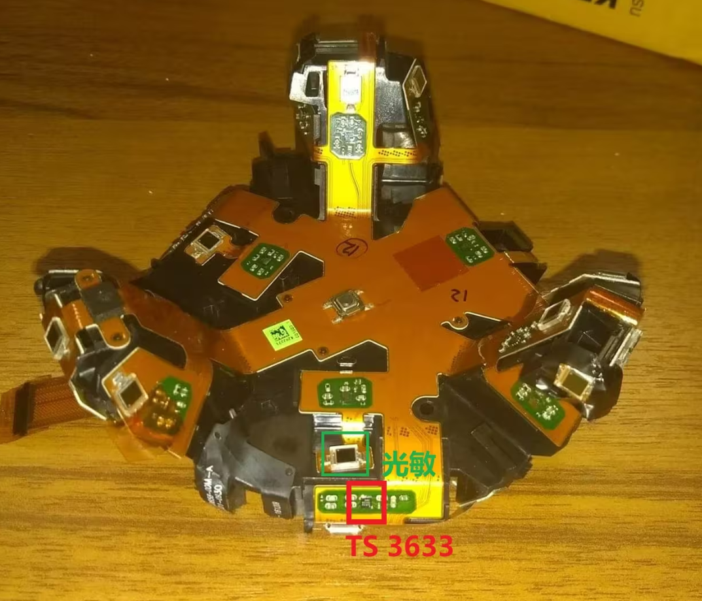

Tracker1.0上覆盖的多组光敏与光电转换器

Tracker1.0主板

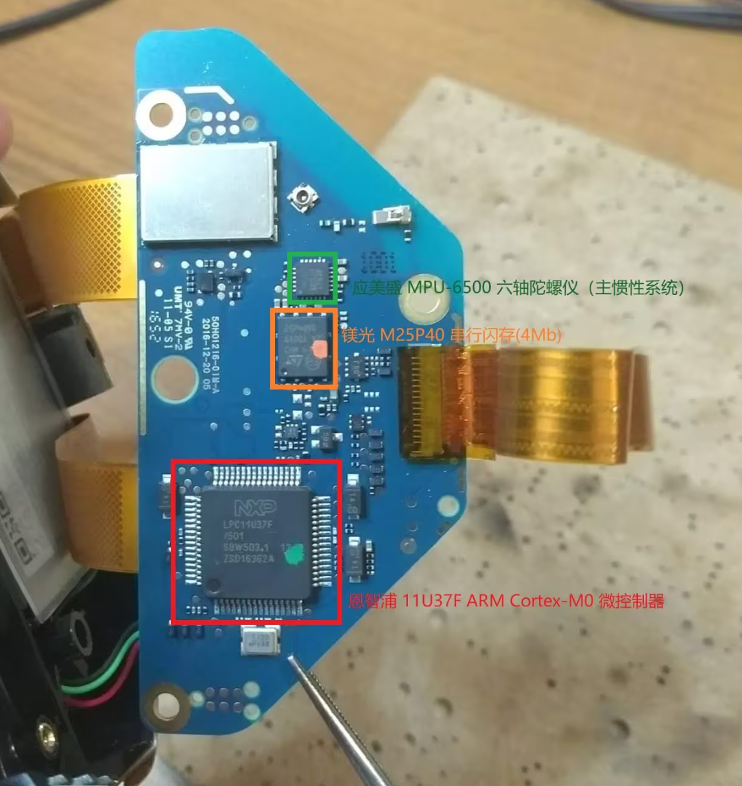

Tracker1.0主板

### 2.3 基站2.0结构和原理

​		第二代基站将原先俩组马达与一组红外光阵列的结构改为单马达集成俩组激光发射器，取消红外光同步模式。每组激光发射器的相对位置有差别（如下图所示），每组发射器点亮时间也略有间隔，发射的每组激光都包含信息(包括识别信息)。当搭载TS4231或TSTS4631芯片的追踪器（如Tracker2018、Tracker3.0、Vive Pro头显与Vive2.0手柄等）接收到来自2.0基站的光信息后，追踪器可快速归位并直接进入定位状态，并且可识别捕捉到的激光来自哪一个基站。

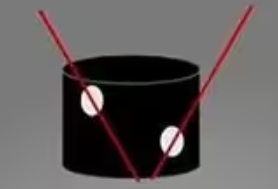

单马达集成俩组激光发射器结构（来自网络）‍

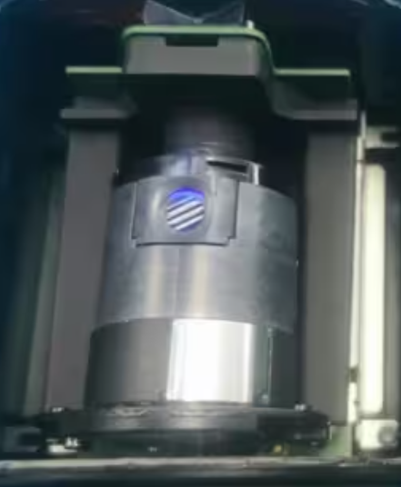

单马达集成俩组激光发射器结构（来自网络）‍

​		2.0基站扫描过程：马达将快速旋转至设定转速，集成的俩组激光发射器旋转至特定位置时，间隔几纳秒分别闪烁一次，呈V字形发射X、Y轴激光。激光组件闪烁俩次后至下一次旋转到特定位置并再次闪烁前为一个扫描周期。如下图所示：

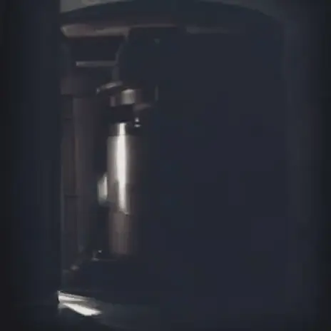

2.0基站运行过程（来自网络）

​		2.0基站取消了红外光同步模式而改为激光通讯，使得每个基站可独立运行（多基站需要设置信道，理论最多16个基站同时运行）且启动、恢复对比1.0基站更加迅速，但不再兼容旧款搭载TS3633芯片（无法解码短波激光信息）的追踪器（如Tracker1.0，Vive初代头显与Vive 1.0手柄等）。**单马达结构也存在弊端**。集成俩组激光发射器且转速非常高的马达更容易损耗。当系统中某个基站上的一组激光发射器出现老化或马达转速异常时，将直接影响到整个系统的定位稳定性。且独立运行且基站间无同步的工作模式更容易导致多个基站之间发射的激光频率产生差异。一个空间内同时运行多个基站时，如果每个基站的相对位置过于紧凑或都处于同一平面（扫描区域重合较多）可能会导致追踪器对多个方向的激光束接收混乱，产生所谓“干扰”丢追现象。

### 2.4 基站2.0模式下追踪器定位原理 

​		每个追踪器表面都覆盖有多组光敏传感器与光电转换器。当一组光敏传感器俩次捕捉到来自基站的激光后，由该组光敏组件上搭载的光电转换器（TS4231或TS4631）开始解码短波激光信息并分别计算这俩组（X轴与Y轴）激光到达该组光敏的角度与时间，这个时间正好是基站俩组激光发射器旋转至特定位置的时间与发射激光的角度（基站位置为绝对静止，马达转速与激光发射器点亮时间为已知）而分布在追踪器上的光敏传感器的位置也是已知的，便可依此得到一组时间差数据发送给微控制器与FPGA。追踪器通过结合多组光电转换器得到的时间差数据并融合IMU惯性系统进行计算，随后将数据发送给电脑，便可得出追踪器的绝对位置与运动轨迹。

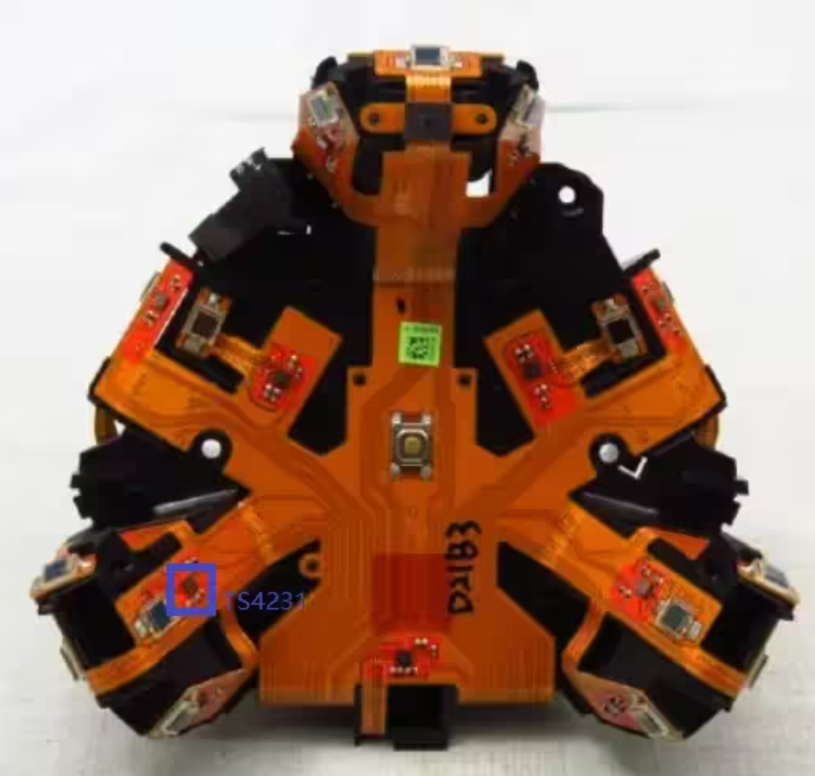

Tracker2.0上覆盖的多组光敏传感器与光电转换器（来自网络）

​		Tracker2018拆解图如下图所示:

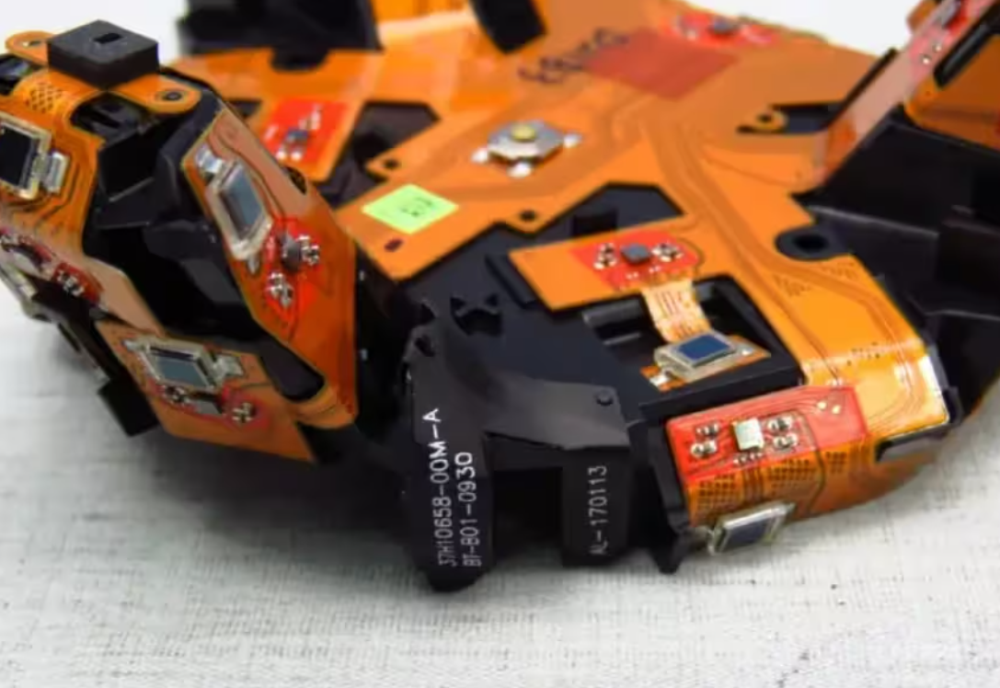

Tracker2018搭载的TS4231芯片将刷新率从上一代TS3633的60Hz提升到了100Hz，效率更高

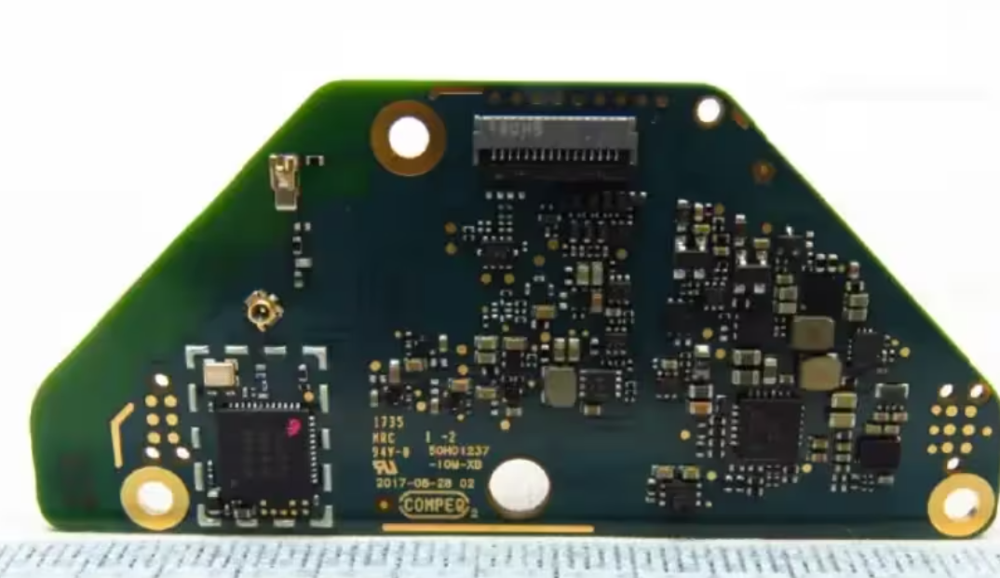

Tracker2018主板

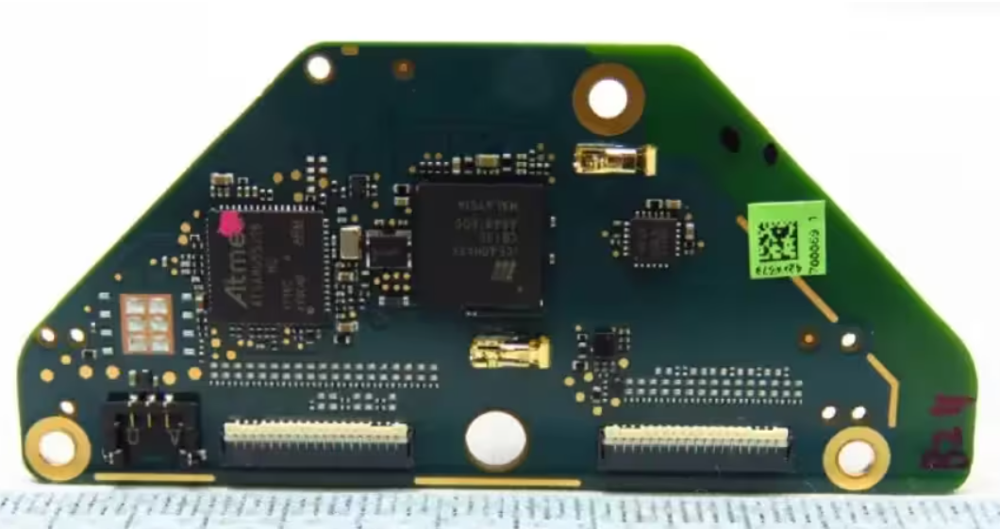

Tracker2018使用ATSAMG55微处理器

### 2.5 Tracker3.0拆解图

​		Tracker3.0压缩了体积，但保持了覆盖光敏组件的数量。

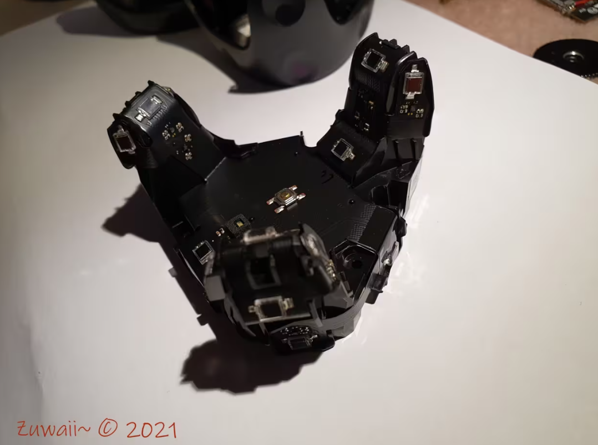

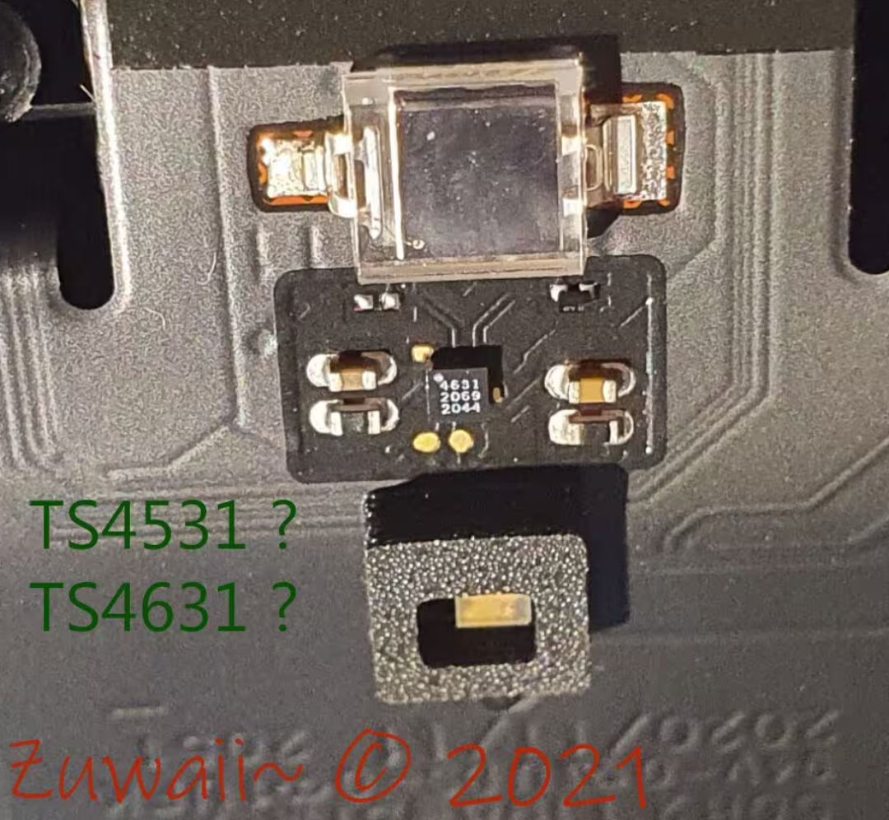

Tracker3.0上搭载的TS4631芯片

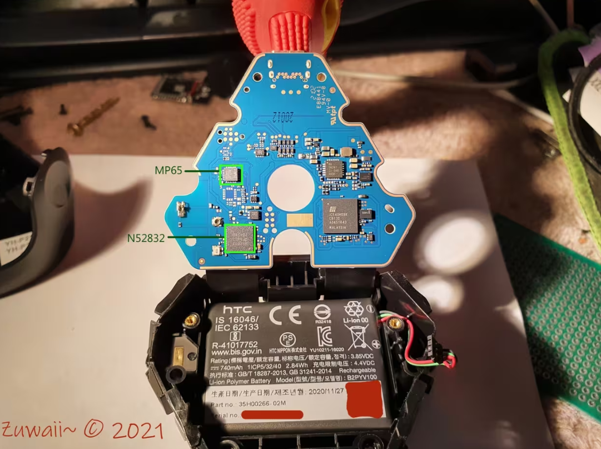

Tracker3.0上的主板

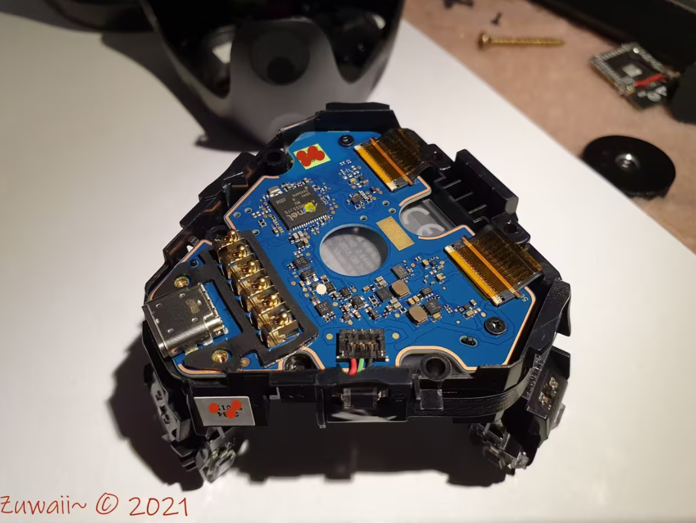

Tracker3.0上的主板

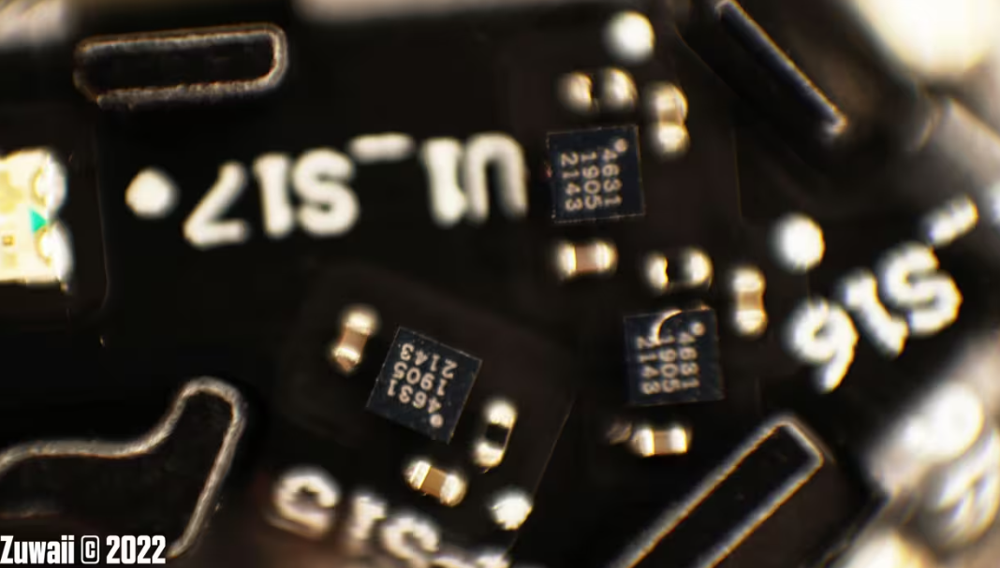

Index手柄上搭载的TS4631芯片特写：

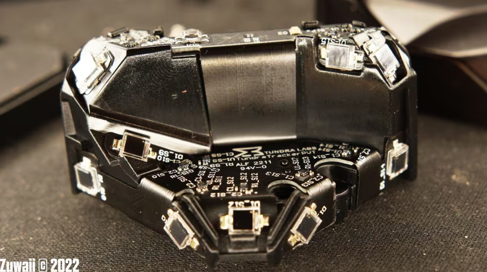

N7R似乎采用的是和HTC同款方案，效果却不及HTC
