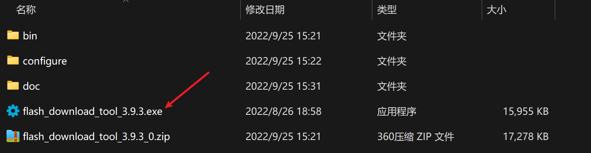
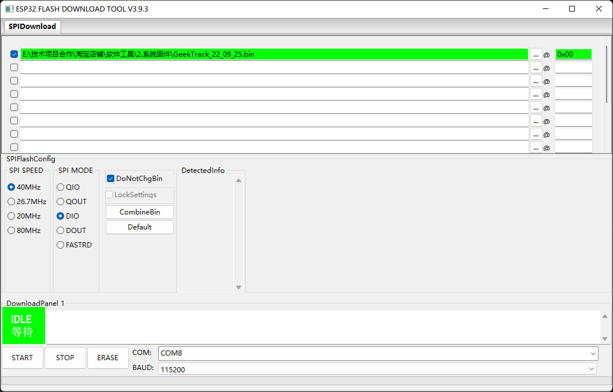

# ESP32代码烧写工具使用指南

2022-09-25

1、打开flash_download_tool_3.9.3.exe

2、ESP32的分区烧写

ESP32烧写主要有三个部分组成，一个是系统固件XXX.Bin、第二个是Bootloader.bin、第三个是分区表partition-table.bin等部分组成。

3、根据以上的信息我们可以知道有3个文件，分别从0x10000,0x1000,0x8000地址烧写。大致的大小为700KB，26KB，3KB。在ESP32 IDF的Build工程中，找到这三个文件分别为XXX.Bin、Bootloader.bin、partition-table.bin，按照信息填写烧写工具：

4、通过整合Bin的方式烧写固件

​		上述的方式虽然可行，但是操作较为麻烦。所以利用ESP32烧写的工具对固件进行合并(CombineBin)。合并好的固件就可以从0x00开始烧写。非常的方便。

3.选择GeekTrack所在的COM口

4.点击START 下载固件